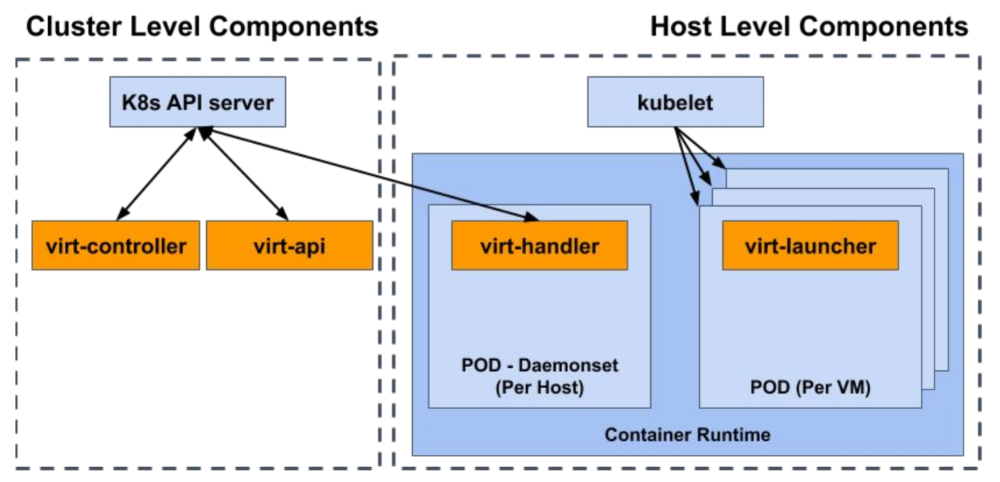

## Technical Overview

Kubernetes allows for extensions to its architecture via
[*custom resources*]( https://Kubernetes.io/docs/concepts/extend-Kubernetes/api-extension/custom-resources/),
which add a new endpoint in the Kubernetes API that stores and retrieves a
collection API objects of a certain kind.
The *custom resources* by themselves only
enable store and retrieve structured data;
to add business logic and specific functionality,
[*custom controllers*]( https://Kubernetes.io/docs/concepts/extend-Kubernetes/) are needed.
*Controllers* are clients of the Kubernetes API-Server that typically read an
object's `.spec`, possibly do things, and then update the object's
`.status`.

KubeVirt uses CRDs, *controllers* and other Kubernetes features, to
represent and manage traditional virtual machines side by side with
containers.

KubeVirt's primary CRD is the VirtualMachine (VM) resource, which manages
the lifecycle of a VirtualMachineInstance (VMI) object that represents a
single virtualized workload that executes once until completion
(i.e., powered off).

### Project Components
The key KubeVirt components are the virt-api, the
virt-controller, the virt-handler, and the virt-launcher.

 * **virt-api**: This component provides a HTTP RESTful entrypoint to manage
   the virtual machines within the cluster.
 * **virt-controller**: This component is a Kubernetes controller that
 manages the lifecycle of VMs within the Kubernetes cluster.
 * **virt-handler**: This is a daemon that runs on each Kubernetes node.
It is responsible for monitoring the state of VMIs according to
Kubernetes and ensuring the corresponding libvirt domain is booted or
halted accordingly. To perform these operations, the virt-handler has a
communication channel with each virt-launcher that is used to manage the
lifecycle of the qemu process within the *virt-launcher* pod.
 * **virt-launcher**: There is one per running VMI.
This component directly manages the lifecycle of the qemu process within
the VMI's pod and receives lifecycle commands from virt-handler.

### Scripts

 * `cluster/kubectl.sh`: This is a wrapper around Kubernetes' kubectl command so
   that it can be run directly from this checkout without logging into a node.
 * `cluster/virtctl.sh` is a wrapper around `virtctl`. `virtctl` brings all
   virtual machine specific commands with it. It is supplement to `kubectl`.
   e.g. `cluster/virtctl.sh console testvm`.
 * `cluster/cli.sh` helps you creating ephemeral kubernetes and openshift
   clusters for testing. This is helpful when direct management or access to
   cluster nodes is necessary. e.g. `cluster/cli.sh ssh node01`.

### Makefile Commands

 * `make cluster-up`: This will deploy a fresh environment, the contents of
   `KUBE_PROVIDER` will be used to determine which provider from the `cluster`
   directory will be deployed.
 * `make cluster-sync`: After deploying a fresh environment, or after making
   changes to code in this tree, this command will sync the Pods and DaemonSets
   in the running KubeVirt environment with the state of this tree.
 * `make cluster-down`: This will tear down a running KubeVirt environment.
